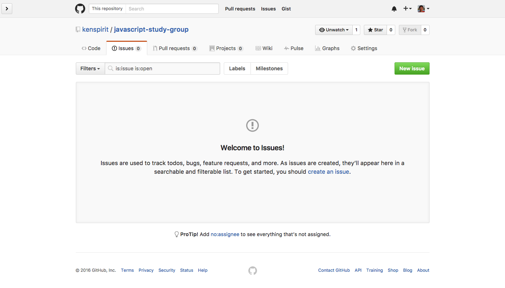
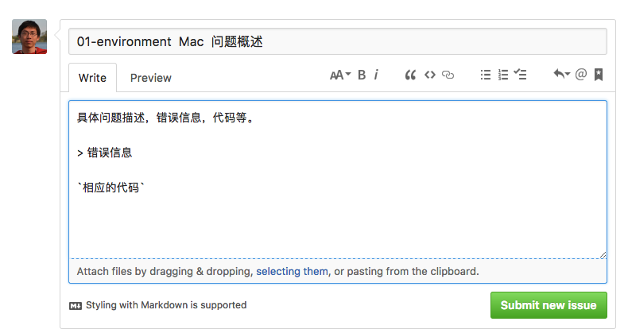

本项目让 JavaScript 入门者，从零开始，到最后搭建一个完整的 Wechat 公众号后台。学习者不单单能根据工具和套路迅速实现项目，最重要的是学会基本的系统设计，前后端集成，以及系统上线。根据教程最后能做出来的功能，是可以让公众号的订阅者，发送图片的时候，随机获取其它订阅者的图片，实现图片交换的功能。同时这个项目也是让学习者共同交流的地方。  

详细教程请看 `tutorial` 文件夹。木板样例请看 `project` 文件夹。  

##资料和工具

[Tasting JavaScript]: https://leanpub.com/tasting-javascript
[Evergrow]: https://github.com/kenspirit/generator-evergrow

1. 我写的书 [Tasting JavaScript][]  
2. 我写的系统搭建脚手架 [Evergrow][]  

##参与学习方式

1. Fork 本项目  
2. 填写 `participants.md`，提 Pull Request  
3. 成员自学项目教程，并通过 Pull Request 提问  
4. 每周一篇 500 字以上学习总结（不含代码）。填写 `retrospect_articles.md`，发 Pull Request  

##提问的方式

点击 Issues 标签：

新建一个 Issue 来提问的格式：

最开始填 tutorial 的文件名，空两格再标注 你的操作系统，最后是问题的概述。里面填写问题详细描述，包括错误信息，代码等。  

注意如何提问，清晰表达你的问题。

##赞助

如果你觉得这个教程对你的学习有帮助，请告诉其它同样有兴趣学习的小伙伴。如果能打赏一瓶饮品或者快餐钱以资鼓励，更不胜感激。  

## License

 © [Ken Chen](http://www.thinkingincrowd.me)

Attribution-NonCommercial-ShareAlike  

CC BY-NC-SA
