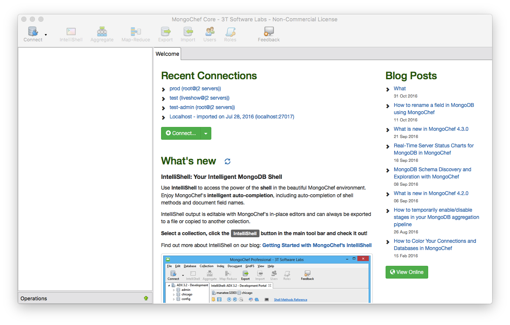
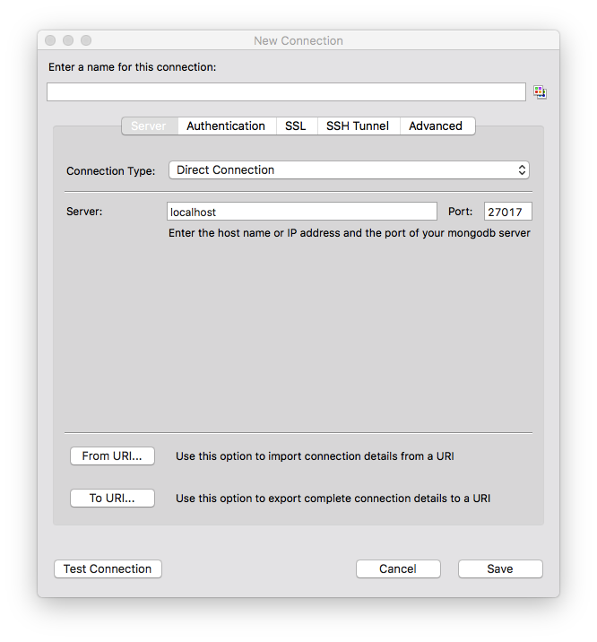

[工程师的时光穿梭机 —— git]: http://xiaolai.li/2016/07/05/makecs-git-basics/
[基本开发环境设置]: http://xiaolai.li/2016/06/16/makecs-basic-dev-env-settup/

首先，大家可以参考笑来老师的 [工程师的时光穿梭机 —— git][]，和[基本开发环境设置][]。当然，你不需要安装 rvm 和 Ruby。  

## Node.js & NPM

Node.js 可以安装 6.3.1 的版本。不安装最新的 LTS 版本是因为它使用 node-inspector 会有问题，这个工具是以后有需要 debug 的时候用的。安装 nvm 有麻烦的，可以不用装它。直接上官网下载对应的版本来安装吧。

安装网址：https://nodejs.org/download/release/v6.3.1/

Windows 64bit 机器：
node-v6.3.1-x64.msi 

Windows 32bit 机器：
node-v6.3.1-x86.msi

Mac：
node-v6.3.1.pkg

安装完以后，升级一下 NPM。在命令行输入以下命令：

>npm install npm@latest -g

国内使用 npm 比较慢，可以安装 cnpm 方便以后使用。输入以下命令：

>npm install cnpm -g

又或者，你可以玩一下 Yarn：https://yarnpkg.com/en/docs/install

## MongoDB

Community Server 在这里下载：https://www.mongodb.com/download-center?jmp=hero#community

那里有 Installation Guide 和下载包。大家看一下。

### Windows

Window 安装官方教程：https://docs.mongodb.com/manual/tutorial/install-mongodb-on-windows/

Window Hotfix 安装：https://support.microsoft.com/en-us/kb/2731284

基本步骤：

**安装**  

双击 .msi 文件

**设置数据目录**  

默认 MongoDB 会把数据放在这里 `\data\db`。所以，你先创建一个目录：

>md \data\db

**启动 MongoDB 数据库**

>mongod.exe

### Mac

**安装**  

* 用 brew 安装：  

>brew install mongodb

* 手动安装：  

  * 下载：  

    >curl -O https://fastdl.mongodb.org/osx/mongodb-osx-x86_64-3.2.10.tgz

  * 解压：  

    >tar -zxvf mongodb-osx-x86_64-3.2.10.tgz

  * 改个短点的名字：

    >mv mongodb-osx-x86_64-3.2.10/ mongodb

  * 把可执行命令放到你的个人配置，根据你自己的编辑器，选择下面合适的命令：  

  Atom:  

  >atom ~/.bashrc

  Sublime:  

  >subl ~/.bashrc

  把下面这行加到最下面，然后保存推出：  

  >export PATH=<mongodb-install-directory>/bin:$PATH

  _<mongodb-install-directory> 要替换成你的 mongodb 放的位置。在那个目录下，打 `pwd` 就可以得到。_

**设置数据目录**  

默认 MongoDB 会把数据放在这里 `/data/db`。所以，你先创建一个目录：

>mkdir -p /data/db

**启动 MongoDB 数据库**

>mongod

### 测试连接 MongoDB服务器

下载一个 MongoChef 客户端，后面连 MongoDB 服务器用：

http://3t.io/mongochef/#mongochef-download-compare

打开的样子：

点 Connect 那个大图标，会有一个连接管理窗口。

点 New Connection，会看到下面的窗口。

默认你什么都不用填，写个名字就可以了。点 Save 前点 Test Connection 测试一下是否成功。可以连接就可以了，暂时你不用理它。  

## Redis

下载安装指南：http://redis.io/download

### Mac

Mac 就按照上面的步骤来就可以了。

### Windows

在这里下载 msi 文件安装：https://github.com/MSOpenTech/redis/releases

启动服务器命令：  

>redis-server.exe

连接服务器命令：  

>redis-cli.exe

### 图形化客户端

Medis: https://github.com/luin/medis
