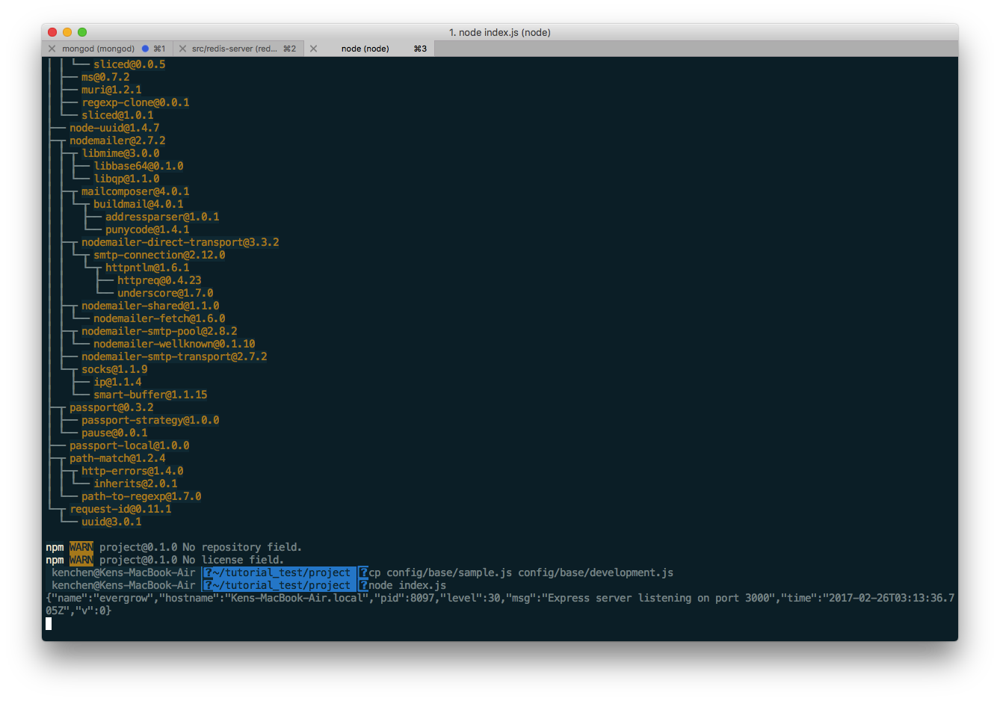
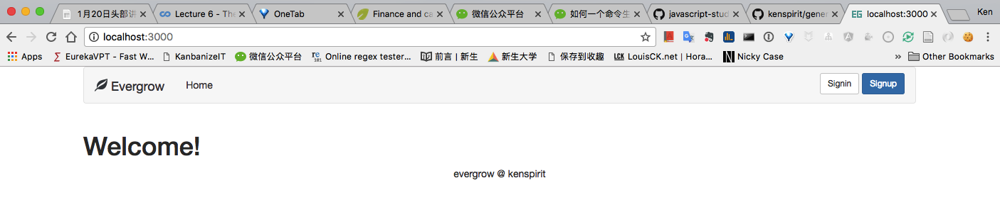
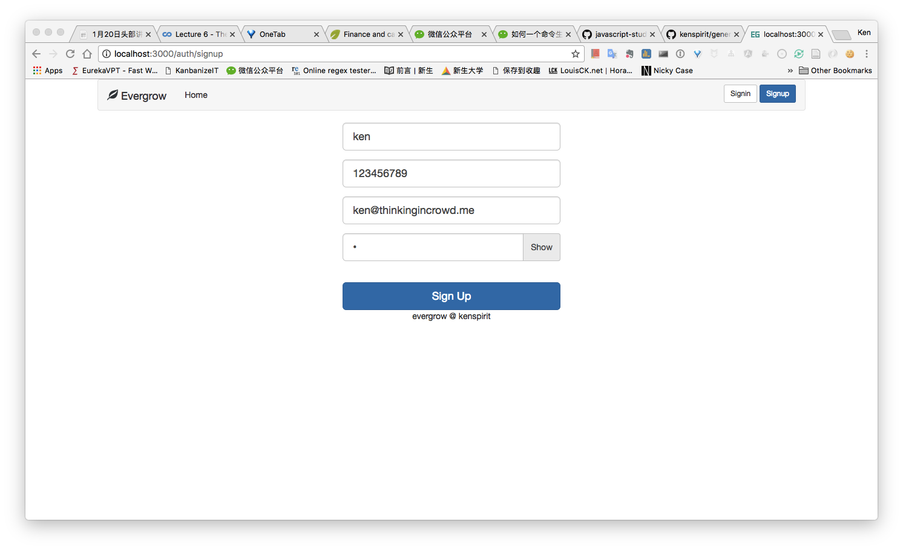

# Node.js 微信后台搭建系列 - Web App 骨架

骨架是通过 Yeoman 的一个脚手架 evergrow 来搭建的。有兴趣可访问 https://github.com/kenspirit/generator-evergrow 。

## 搭建 Node.js 系统

打开一个新的命令行窗口

**安装**  

* 安装 Yeoman：  

  >npm install -g yo

* 安装脚手架 evergrow：  

  >npm install -g generator-evergrow

**搭建项目**

* 新建项目目录并进入：  

  >cd ~/tutorial_test

  >mkdir project

  >cd project

* 生成项目，默认双击 Enter 两次就可以了

  >yo evergrow

**配置并启动项目**

* 安装依赖（要等一段时间）

  >npm install

* 配置

  >cp config/base/sample.js config/base/development.js

* 启动

  >node index.js

启动成功，你应该看到下面的提示页面：  

## 访问并使用

* 在浏览器输入 `http://localhost:3000`

* 点击 Signup 注册并登录使用

现在你已经具备一个完整的 Node.js 后台系统。
