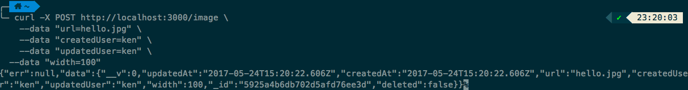
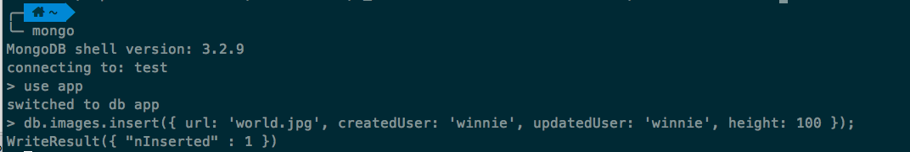
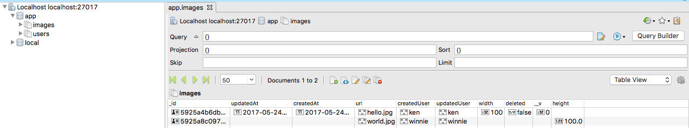

# Node.js 微信后台搭建系列 - 数据建模

数据建模，好高大上的名字啊。简单来说，就是为了系统要存储的数据，设计它的结构。还是不懂？就是想好你要存储的数据，包含什么信息，怎么存。  

## 例子和实操

### 目标

既然我们的系统要存储用户上传的图片，那肯定要设计一个关于图片信息的模型。  

### 实现目标的步骤

回到 [Web App 骨架](./02-boilerplate.md) 那一章生成了项目脚手架的目录下，执行一句命令：  

>yo evergrow:model Image

命令最后的 `Image` 代表模块的名字。命令运行之后，你会看到它提醒你生成的目录和文件。  

```bash
  create module/image/image-routes.js
  create module/image/image-model.js
  create module/image/image-manager.js
  create module/image/image-controller.js
```

上面的命令其实已经生成 Image 模块的后台基本模板。目前你只需要重点看 `module/image/image-model.js` 就好了。后面的章节会再详细说明其它文件有什么用。  

`image-model.js` 里面的内容默认是下面那样的。你先不用太深究为什么这么写，因为这就是**套路**。  

```javascript
  var mongoose = require('mongoose')
  var Schema = mongoose.Schema

  var ImageSchema = new Schema({
    createdUserId: {type: Schema.Types.ObjectId, required: true},
    createdUser: {type: String, required: true},
    updatedUserId: {type: Schema.Types.ObjectId, required: true},
    updatedUser: {type: String, required: true},
    deleted: {type: Boolean, default: false}
  }, { timestamps: { createdAt: 'createdAt', updatedAt: 'updatedAt'}})

  module.exports = mongoose.model('Image', ImageSchema)
```

现在既然要保存图片信息，那加上 `url`，`width` 和 `height` 字段来分别存储图片的路径，宽和高吧？然后先暂时清除掉 xxxxUserId 等我们暂时不用的字段。修改后文件内容应该是这个样子：  

```javascript
  var mongoose = require('mongoose')
  var Schema = mongoose.Schema

  var ImageSchema = new Schema({
    url: {type: String, required: true},
    width: Number,
    height: Number,
    createdUser: {type: String, required: true},
    updatedUser: {type: String, required: true},
    deleted: {type: Boolean, default: false}
  }, { timestamps: { createdAt: 'createdAt', updatedAt: 'updatedAt'}})

  module.exports = mongoose.model('Image', ImageSchema)
```

有一些同学，看到不懂的单词或者东西就不太舒服。我简单说一下上面代码里一些关键的东西是有什么作用吧。  

1. `mongoose` 是帮我们通过代码来操作 MongoDB 的工具，我们通过 `require` 的方式来使用它。MongoChef，命令 `mongo` 也是操作 MongoDB 的工具，只不过一个通过界面，一个通过命令。  

2. `Schema` 其实就是规范了我们的数据存储格式和结构。比方说我们现在的 `ImageSchema` 就能存储图片路径，创建和更改的用户，以及时间等。  

3. 最后一句就是把这个数据模型命名为 `Image`，MongoDB 数据库也会把数据存储到名字叫 `images` 的空间。目前我们还没有数据，如果你之前曾经在脚手架系统启动后尝试过注册帐号，你应该可以看到一些用户信息。  


### 添加测试数据

在项目脚手架的目录下，执行下面的命令来启动项目：  

>node index.js

* 通过系统 API 和代码的调用来添加数据。(Windows 用户自行查找一下 curl 的使用)  

Mac 环境下，复制下面的命令，粘贴到另一个新开的命令行窗口，并按 Enter 执行（末尾的 \ 是需要的）：  

```
  curl -X POST http://localhost:3000/image \
    --data "url=hello.jpg" \
    --data "createdUser=ken" \
    --data "updatedUser=ken" \
    --data "width=100"
```

运行正常后应该能看到下图。  



* 通过 mongo 命令来添加数据。

新开的命令行窗口，然后执行命令。

>mongo

在 MongoDB 的环境里面，一次执行下面两个命令：

>use app

>db.images.insert({ url: 'world.jpg', createdUser: 'winnie', updatedUser: 'winnie', height: 100 });

运行正常后应该能看到下图。  



最后，在 MongoChef 可以看到不同方式添加的数据有什么区别。通过代码添加的，会额外补充一些默认的数据，那些是 `mongoose` 通过 `Schema` 的定义来实现的。  



如果你力有余，不妨看看[深入讲解数据建模](./04-data-modeling-in-depth.md)这一部分。  
