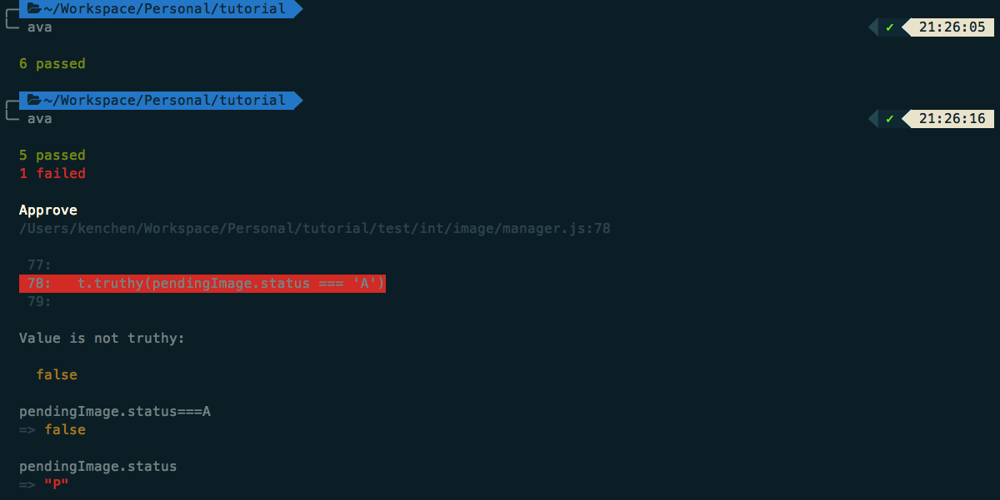

## 自动化测试

虽然我们写了好一些方法，但是目前都没有页面可以操作。很多同学肯定有点心慌慌，也不知道写的对不对。  

下面我教你怎么写自动化单元测试代码，来验证自己写的代码的正确性。（虽然有可能你写的自动化单元测试代码也有问题，跑不动，或者验证不了实际代码的正确性，哈哈哈）  

在我们执行命令 `yo evergrow:model Image` 的时候，其实还生成了一个测试文件：`test/int/image/manager.js`。  

刚打开这个文件的时候，你可能会吓一跳。代码看上去挺多的，而且还有不少没见过的东西。但是，其实读它就像读一篇文章一样。它做的事情就是：  

1. 连接数据库  
2. 创建一条 Image 记录，验证数据是否正确  
3. 验证是否能通过 ID，用批量查找的函数，找回刚创建的 Image 记录  
4. 验证是否能通过 ID，用单条记录打开的函数，找回刚创建的 Image 记录  
5. 验证修改 Image 记录的功能是否正常  
6. 验证删除功能是否正常，能把刚创建的 Image 记录删除  
7. 断开数据库连接  

这个文件里面的每一个 `test.serial` 包着的代码，其实就是一个测试用例。`.serial` 的意思是这些测试用例必须按顺序执行。如果不需要指定顺序，则可以去掉 `.serial`。  

### 添加测试用例

我们添加一个验证 `approve` 方法的测试用例吧。  

```javascript
  // 新加的测试用例
  test('Approve', async t => {
    const data = {
      url: 'approve.png',
      createdUserId: new mongoose.Types.ObjectId(),
      createdUser: 'Created',
      updatedUserId: new mongoose.Types.ObjectId(),
      updatedUser: 'Created'
    }

    const pendingImage = await ImageManager.create(data)

    // 第二次运行的时候，把这里的 'P' 改成 'A'，模拟验证出错的效果
    t.truthy(pendingImage.status === 'P')

    const approvedImage = await ImageManager.approve(pendingImage._id)

    t.truthy(approvedImage.status === 'A')

    await ImageManager.remove(approvedImage._id, true)
  })

  test.after('cleanup', async t => {
    await DbManager.disconnectDB()
  })
```

### 运行测试

* 安装自动化测试工具 ava：  

>npm install --registry=https://registry.npm.taobao.org ava -g

* 运行测试

>ava

下面是执行过两次 `ava` 命令，一次正常，一次故意出错的效果：  




## 异步操作和 Promise

[文档]: http://bluebirdjs.com/docs/getting-started.html
[Why Promise]: http://bluebirdjs.com/docs/why-promises.html

异步操作是 Node.js 里面，让不少新手，甚至是其它语言转过来的学习者感觉不适应的一个特性。Node.js 里面原生支持的异步操作是使用 callback 的方式。  

不过，由于本脚手架提供的默认操作，都基于 Promise 并用它来处理异步操作，所以，后面有机会我再讲解 callback 的使用方式，目前我们先学习 Promise 的用法。  

不知道你留意到没，到目前为止，我们已经接触了两种使用 Promise 来处理异步操作的方法了。  

第一次是在写 `random` 方法时，`.then()` 的用法。  
第二次是刚刚单元测试时，在调用 `ImageManager` 各种 CRUD 方法前面加上了 `await`。  

大部分人可能都觉得，使用 `await` 的方式更容易理解，因为这样和那些同步操作的代码没什么区别。那为什么在 `random` 那里不用 `await` 这种写法呢？其实，这种用法是 JavaScript 未来的特性，它暂时没有在 Node.js 得到原生支持。只是 `ava` 这个工具能帮我们翻译，所以才可以在写测试用例的时候直接使用。  

我们也可以改成用 `.then()` 这样写法来写刚才那个测试用例的：  

```javascript
  test('Approve', async t => {
    const data = {
      url: 'approve.png',
      createdUserId: new mongoose.Types.ObjectId(),
      createdUser: 'Created',
      updatedUserId: new mongoose.Types.ObjectId(),
      updatedUser: 'Created'
    }

    await ImageManager.create(data)
      .then(function(pendingImage) {
        t.truthy(pendingImage.status === 'P')

        return ImageManager.approve(pendingImage._id)
      })
      .then(function(approvedImage) {
        t.truthy(approvedImage.status === 'A')

        return ImageManager.remove(approvedImage._id, true)
      })
  })
```

这里仅仅保留第一个 `await` 来通知 `ava` 要等待整个操作结束，其它所有的操作都转成用 `.then()` 串联起来的写法。它的使用就像接力棒，或者数据处理流水线似的。上一个操作做完，把结果送到下一个操作；下一个操作又把结果 `return` 出去给再下一个。  

_注意：如果我们的测试用例涉及异步操作，那么，一定记得要把测试声明为异步，也就是标记为 `async t`。不然 ava 会认为没有异步操作，不等结果回来就认为测试完成了。_  

如果你觉得 Promise 不好理解，这非常正常。你可以先不深入理解它的概念，只要知道可以一直在后面接着 `.then()`，并且在每一个 `.then()` 里面记得返回给下一个操作的数据就可以了。有兴趣深入了解 Promise 的同学，可以从 [Why Promise][] 开始，看看我用的 bluebird 库的[文档][]。  
