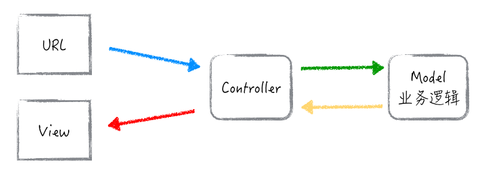
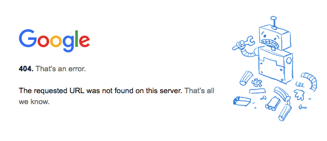
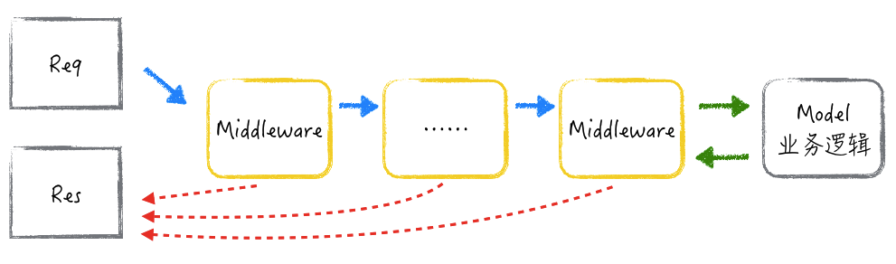
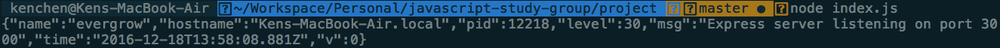
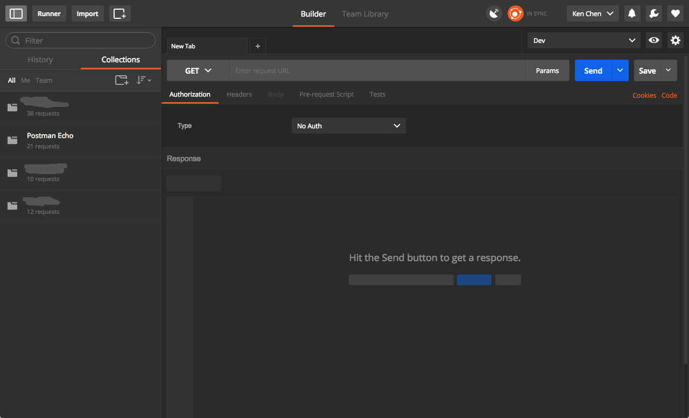
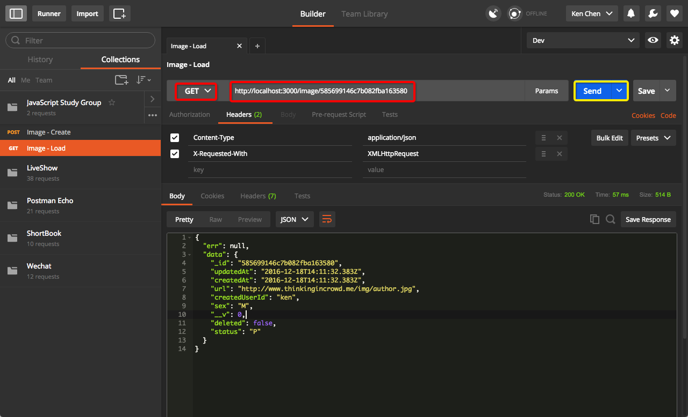
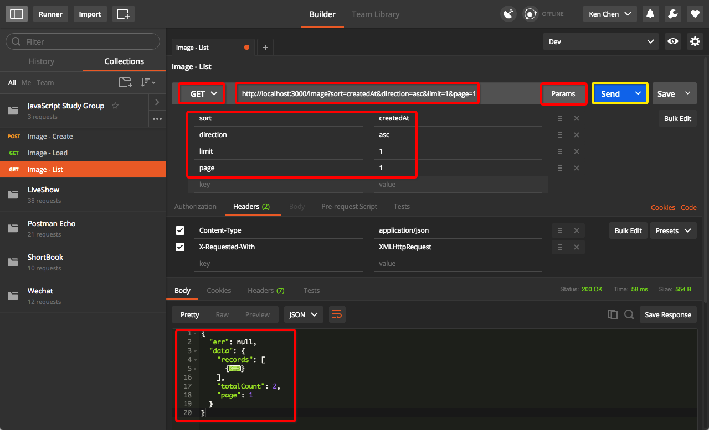

# Node.js 微信后台搭建系列 - 路由和控制器

[MVC]: https://en.wikipedia.org/wiki/Model–view–controller

这一章我们要讲的是 [MVC][] 的 C，也就是 Controller。在 Web Application 里谈到 Controller，我们就不可避免地要了解 **MVC 对数据处理的流程**和涉及**路由**这个概念。大家可以通过这个简略的流程图来辅助理解下面的一些概念。  



## MVC 处理流程和路由

http://www.thinkingincrowd.me/2016/11/27/Node-js-Wechat-Web-App-Tutorial-Business-Logic/

通过在浏览器输入上面的网址（URL），我们就能看到相应的网页内容。这背后其实是有相应的服务器，根据网址把与其相对应的内容返回给你。服务器由域名，也就是 **www.thinkingincrowd.me** 部分决定。而具体内容就是根据路径 **2016/11/27/Node-js-Wechat-Web-App-Tutorial-Business-Logic** 来定位的。  

**MVC 中的路由，就是路径和 Controller 的对应关系**。

路由大致可分为两种：静态文件，和动态内容。但是它们的原理是一样的。静态文件的路由，就是那个路径直接对应了服务器背后的图片，HTML，JS 或者 CSS 等静态文件，服务器不需要额外处理，找到了就直接返回文件的内容。**Web Application 中处理动态内容的路由，需要通过调用绑定的 Controller，再经过 Model 或业务逻辑层处理，最后把结果返回**。服务器如果根据路径找不到对应的 Controller，一般会返回 404 状态，而你们就有可能见到这种类似的页面。  



## Controller 控制器

Controller 的功能是什么呢？  

### 收集用户提交的数据  

浏览网页的时候，用户可能不需要提供额外的数据给服务器，只需要网址 URL 就可以了。但是，比如当我们要查询酒店信息，下订单的时候，我们还是要提交相应的数据让服务器处理。  

用户和服务器打交道，其实是通过 HTTP 协议提供的 GET, POST, PUT, PATCH, DELETE 等操作来实现的。  

* GET: 这种操作是从服务器获取数据。**它不应该对你要获取的数据做任何的修改**。当我们通过 GET 操作和服务器沟通的时候，数据是同 URL 网址一起传到服务器的，会受到长度的限制。  

* POST: 这种操作是创建或更改后台数据。POST 操作的数据是放在请求体里面，并没有数据大小的限制。  

大多数情况，我们用的是这两种 HTTP 操作，其它几种在一些旧的服务器中并不支持。所以，我们暂时了解 GET 和 POST 的不同，以及要注意的地方就够了。大家有时间可以看看[这个简易教程](http://www.restapitutorial.com/lessons/httpmethods.html)来了解其它 HTTP 操作，但不是必须。  

### 转交给业务逻辑层处理  

很多新手，都会把大量的代码写到 Controller，使之变得越来越臃肿，庞大。究其原因，就是因为他们没法很好区分 M 和 C 的区别，并把代码组织得更加合理。我们写代码的时候，应该时刻考虑它们是应该放到 Controller，还是业务逻辑层。  

最关键的判断依据就是：**Controller 里面只放和 V (View) 相关的逻辑，不同的 V，通常有不同的 C 来对应和处理。业务逻辑层的代码，不应该和 View 有关系，而是应该可以给不同的 Controller 和 View 共用**。  

View 是什么？就是不同的表现层，不同的前端界面。同样的一个业务逻辑，是可以提供给不同的界面，比如 Web 页面，iOS，Android，邮件或者外部系统等。当然，现在大家可能无法很好的理解这一点。先留个印象，代码写的越多，就越有体会。  

### 把业务逻辑层处理后的结果，按照要求的格式返回  

什么叫要求的格式呢？谁提出来的要求？前端。  

* 对于静态页面来说，返回的是某一个 HTML 文件内容  
* 对于动态页面来说，返回的是填充了内容的 HTML 页面模板  
* 对于 Ajax 请求来说，返回的是 JSON 或者 XML 格式的数据  

其实不同的格式要求，也是可以看作是不同 View 的其中一种情况。  

## evergrow 脚手架的路由和控制器

现在我们来结合 evergrow 脚手架生成的代码，进一步理解上面说的基本概念和使用套路。  

### 定义 Controller

[业务逻辑层那一章]: ./05-business-logic.md

在[业务逻辑层那一章][]，我们讲到 CRUD 这四个最基本的数据操作。Controller `module/image/image-controller.js` 其实也包含了对应的几个方法：  

```javascript
  module.exports = {
    listImagePage: listImagePage,
    loadImagePage: loadImagePage,
    listImage: listImage,
    loadImage: loadImage,
    createImage: createImage,
    updateImage: updateImage,
    removeImage: removeImage
  }
```

_`listImagePage` 和 `loadImagePage` 是打开图片列表页和详情页的，就像你上淘宝或者京东那种产品列表和产品详情页。这个我们回头讲 View 的时候再展开，我们先来看其它的 CRUD 方法。_  

首先，我们来看读取单一图片数据的方法：  

```javascript
  function loadImage(req, res, next) {
    ImageManager.load(req.params.id)
      .then(function(entity) {
        return res.json(buildApiResponse(entity))
      })
      .catch(next)
  }
```

[Express 框架的中间件]: http://expressjs.com/en/guide/writing-middleware.html

这个方法是我们 MVC 的一个 Controller，但其实也是一个 [Express 框架的中间件][]。中间件是什么呢？我们来看下图：  



* Req 是请求。它承载着请求的HTTP 操作（GET/POST），路径（URL），和参数等。  
* Res 是回复。我们通过它决定什么时候返回，以及返回什么数据给发出请求的人或系统。  
* Middleware 就是 Express 的中间件。  
  1. 对应一个 URL 路径，我们可以设置一到多个中间件  
  2. 请求依次通过每一个中间件，如果没有中途返回（红色那些虚线）的话  

我们可以把中间件想像成流水线上负责不同生产步骤的工人。每一个工人都拿着上游传递过来的半成品（Req）进行检查或处理。如果某一位置的工人处理时发现半成品有问题，可以中途打回，如果没问题，加工后再传递到下一层。能顺利通过所有的检查和处理的，就到达业务逻辑层，最后经由（Res）返回成品。  

所以，上面的方法 `loadImage` 其实是最后一个 Middleware。数据到达这里开始交给业务逻辑层 `ImageManager` 处理。然后（then）通过调用 `res.json()` 方法返回 JSON (JavaScript Object Notation) 格式的数据。  

大家如果仔细看文件 `image-controller.js` 里面几个不同的 Controller，会发现有几个微小的 `req` 用法差异：

* `req.query`  
* `req.params.id`  
* `req.body`  

它们的作用都是从 `req` 里面获取用户请求的数据。具体的使用方法，将在下面讲解路由的时候结合说明。  

#### 延伸内容

Controller 里面有两个比较特别的东西。这里只做基本的解释，如果大家暂时觉得不好理解，可以先记住它们的作用，学会在框架里使用这种套路就好。  

[错误处理中间件]: http://expressjs.com/en/guide/error-handling.html

* `next`：它是一个函数。调用方法 `next()` 其实就会把控制权交到下一个 Middleware，把请求交给它处理。  
* `catch`：它能捕获上面处理业务逻辑时候的错误。把 `next` 放在这里，作用就是，当有错误发生的时候，Express 注册的[错误处理中间件][]就会处理这个错误。  

### 定义路由

前面说到：**MVC 中的路由，就是路径和 Controller 的对应关系**。那在这个框架里面，我们怎么定义这个对应关系呢？答案就在 `module/image/image-routes.js`。  

```javascript
  {
    method: 'get',
    path: '/',
    summary: 'Gets all Images',
    description: '',
    action: ImageController.listImage,
    validators: {
      query: joi.object().keys({
        sort: joi.string().valid('createdAt', 'updatedAt'),
        direction: joi.string().valid('desc', 'asc').default('desc'),
        limit: joi.number().integer().max(100).default(10),
        page: joi.number().integer()
      }).with('sort', 'direction')
    }
  },
  {
    method: 'post',
    path: '/',
    summary: 'Creates Image',
    description: '',
    action: ImageController.createImage
  },
  {
    method: 'get',
    path: '/:id',
    summary: 'Load Image profile',
    description: '',
    action: ImageController.loadImage
  }
```

上面这三个路由，分别定义的对应关系是：  

* HTTP `GET` 和 URL `'/'` 对应了 `listImage`，也就是批量读取图片。  
* HTTP `POST` 和 URL `'/'` 对应了 `createImage`，也就是创建图片。  
* HTTP `GET` 和 URL `'/:id'` 对应了 `loadImage`，也就是读取单一图片。  

因为在 `image-routes.js` 里还有这么一段：`module.exports.basePath = '/image'`，所以，批量读取图片的完整 URL 路径就是 `/image/`。`basePath` 的作用是为了隔离不同模块。  

这里有两大点要注意:  

1. 路由的定义和匹配，是按 HTTP 方法 + URL 两者来标识的。  
2. 路由定义的顺序是有讲究的。在 `module.exports.routes` 数组里面，URL 和 Controller 的对应关系，是按顺序注册到 Express 框架里面的。所以，如果一不小心，顺序安排不当，前端发起的请求很可能就被意料之外的 Controller 拦截。  

### REST API 服务的测试

[Postman]: https://www.getpostman.com/　

到这里，其实我们可以测试一下那些能操作图片数据的服务了。没有页面测不了？作为后端开发者，肯定不能说要依赖页面才能测试自己写好的 REST API。下面我们来看看怎么使用 [Postman][] 来做测试。  

我们先启动我们的项目。在命令行，进入项目目录，输入 `node index.js`。项目启动成功应该会输出类似的日志。  



然后我们启动 Postman：  



#### C - Create

我们先通过它来创建一条图片记录：  


大家在红色框的地方输入相应的参数，然后点击 Send 按钮，就可以看到服务器给予正确的返回了。这样就表示数据库已经成功地创建了一条记录。  

Controller 里面使用的 `req.body` 所获取的数据，就是我们在 `Body` 这里输入的 JSON 数据。大家可以尝试一下，在 JSON 数据里面加多一些属性，比如 width, height 之类的，看能否保存到数据库。  

另外，我们其实还可以对传过去的参数做一定的限制和检查。如果我们把路由的定义稍微改一下，你们看如果一些数据不传有什么结果。  

```javascript
  {
    method: 'post',
    path: '/',
    summary: 'Creates Image',
    description: '',
    action: ImageController.createImage,
    validators: {
      body: joi.object().keys({
        url: joi.string().required(),
        createdUserId: joi.string().required(),
        sex: joi.string()
      })
    }
  }
```

[joi]: https://github.com/hapijs/joi

[joi][] 还有更多有趣的用法，有兴趣的可以自己去了解一下。

#### R - Read

通过上面的练习和尝试，我们应该已经创建出来一些测试数据了。现在我们来测试读取记录。  

首先是读取某一条记录：  



服务器怎么知道我要读哪一条记录？Controller 里使用的 `req.params.id` 其实对应的是路由里配置的 `'/:id'`，它通过和真正的URL `http://localhost:3000/image/585699146c7b082fba163580` 进行匹配。截取出来的最后一段，就是记录的 `id`。  

批量读取多条记录的方式就如下图：  



大家可以看到，GET 请求的另一种传递参数方式是如何拼接到 URL 上面的。在 Controller 里面通过 `req.query` 就能获取到这些参数。大家可以通过在 Controller 里加上 `console.log(req.query)` 的方法来调试并打印数据出来看看。你们看到那些特殊的参数，是 evergrow 框架在批量读取数据时，支持的一些特定的系统参数。它们的作用是指示后台如何在数据量比较多的时候，分页返回记录。  

## 练习

* 你能够为 `Updates Image profile` 这个路由，完善好 `body` 的验证部分吗？可以给前面一章新加的 `approve` 方法，加对应的 Controller 和路由吗？  

## 思考

* 大家看到 Controller 和 Manager 这个业务逻辑层有什么不同吗？哪些代码放在 Controller，哪些放在业务层？什么是和 View 相关的处理逻辑？  

[Express Routing Guide]: http://expressjs.com/en/guide/routing.html

* 扩展阅读：[Express Routing Guide][]。为什么我的写法和 Express 的不同？猜猜我为什么要这样定义，和尝试寻找在什么地方和 Express 结合的？  
