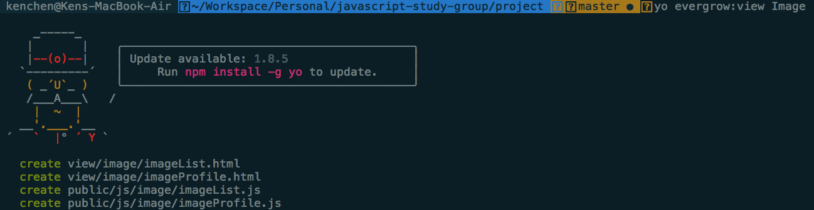
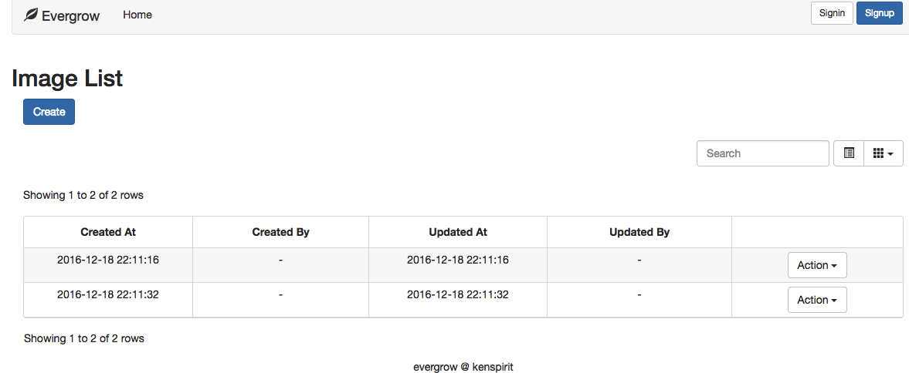
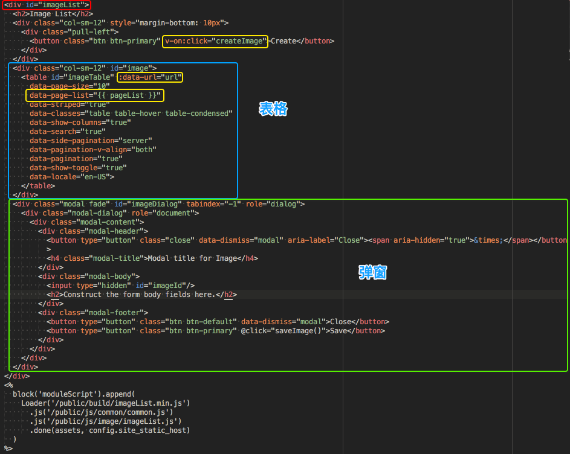
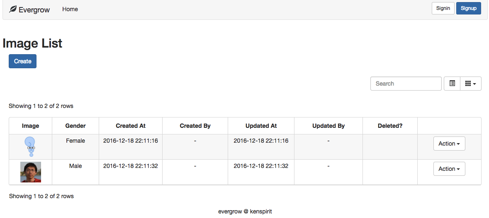
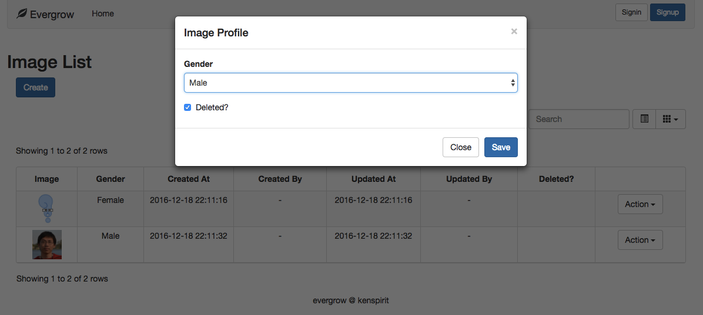

# Node.js 微信后台搭建系列 - 视图

虽然后端开发人员并不一定要学前端，自测也可以借助别的工具完成。但是，了解前端开发的特性，困难点，你才能更好地设计 API，成为一个前端人员乐意合作的好伙伴。  

## evergrow 脚手架生成的视图

用 `evergrow` 脚手架生成视图相关的文件是非常方便的。要接着构建 `Image` 模块的视图，只需要用命令 `yo evergrow:view Image` 就能够生成表格和详情视图所需的 4 个基本文件。  



### 模板引擎（Template Engine）

生成上面的几个基本文件后，其实你在浏览器输入 `http://localhost:3000/image/page/list` 就能够看到如下的默认表格视图。  



根据上一章节的教程，应该不难从代码里找到路由对应的 Controller 为：  

```javascript
  function listImagePage(req, res, next) {
    res.render('image/imageList')
  }
```

和之前介绍的 RESTful API 不同，`res` 在这里调用的是 `render` 方法。这个方法调用模板引擎去寻找匹配的视图模板，处理后返回给前端。**模板引擎最基本的作用**是什么呢？  

* **编译**。浏览器要渲染的视图，是 HTML 格式的文本。我们可以用其它格式（如 Jade）来编写视图模板，再由模板引擎编译成 HTML。  
* **填充动态数据，控制显示样式**。比如，论坛页面可以根据打开用户判断，自己发的帖子或回复能有编辑按钮，其它人就没有。  

[官方文档]: http://expressjs.com/en/guide/using-template-engines.html

具体 Express 框架里怎么使用模板引擎我就不详细介绍了，感兴趣的同学可以看[官方文档][]。在 evergrow 框架里面，具体的配置在 `server-manager.js`：  

```javascript
  // View engine
  app.set('views', './view/') // 模板放置的文件夹
  app.set('view engine', 'html')
  app.engine('html', require('ejs-mate')) // 我们选择的模板引擎是 EJS
```

## HTML & CSS

上述路由对应的页面 `/view/image/imageList.html` 是一个包含了表格的视图。表格是一种相当常见的表现形式，尤其在企业级系统和后台管理页面。它多数用于展示多个同级别的数据。  

实现这个页面的代码其实很简单，HTML 的视图模板和 JavaScript 加起来才 100 行左右的代码。必须注意的是**一开始别深入细节，先从整体结构上面来理解**。  

我们来解构一下 HTML 视图模板。页面分了五大部分：  

1. 标题（`h2` 标签）  
2. 工具栏按钮（`button` 标签）  
3. 表格（`table` 标签，下图中的蓝色框部分）  
4. 编辑数据的弹窗（`modal`，默认隐藏，绿色框部分）  
5. 外部 JavaScript 文件引用（最下面）  



HTML 语言强调的是页面布局。默认情况下，块状元素 `h2`, `table`, `div` 它们就像叠积木一样从上往下堆叠在一起。所以，写前端最基本就是要想好整个页面，是怎么切割成一个个盒子模型（box model），然后组装在一起。  

[Grid System]: http://getbootstrap.com/css/#grid

CSS 能更丰富和精确地定位和布局页面。非纯前端不用了解太细，碰到什么常见的，看得懂就差不多了。比如说，`class="col-sm-12"` 是 Bootstrap 框架的 [Grid System][]。Grid System 其实就是把你的屏幕像栅栏那样平均分割成 12 列。那个 CSS 的意思就是它的大小占满整个屏幕。  

## JavaScript

用 HTML 和 CSS 完成页面布局后，我们就需要用 JavaScript 来为页面的元素赋予行为，比如为用户的鼠标点击做出反应。页面最下方 `<% ... %>` 中间的部分，其实是在后台被模板引擎执行的。怎么用你先不用理会，只要知道引用了 `common.js` 和 `imageList.js` 两个文件就可以了。  

```javascript
  <%
    block('moduleScript').append(
      Loader('/public/build/imageList.min.js')
        .js('/public/js/common/common.js')
        .js('/public/js/image/imageList.js')
        .done(assets, config.base.staticAsset.host, config.base.staticAsset.combo)
    )
  %>
```  

### Vue.js

这个框架是一个轻量级的**双向数据绑定**的前端框架，我们只需要知道最基本的使用方法就够了。我们对着 `/public/js/image/imageList.js` 里面的代码一点点来看吧。  

首先 `el: '#imageList'` 对应了上图红色框框 `id="imageList"` 部分。它表示 Vue.js 框架监控这个 `id` 对应的元素里面包含的所有元素。  

#### 数据

[Data Binding]: http://v1.vuejs.org/guide/syntax.html

`data` 部分是 Vue.js 要监控的 **数据**。如果页面的元素用到了这些数据，当你代码改变这些数据的时候，页面引用的地方也会相应更改。`url` 在黄色框框的 `:data-url="url"` 使用了。`:` 这个小冒号就是让 Vue.js 监控它的意思，并把 `url` 对应的数据 `'/image'` 赋值给 `data-url` 这个给 `bootstrap-table` 库在绘制表格时用到的参数。小冒号是 `v-bind:` 的缩写。都是 Vue.js 的 [Data Binding][] 语法。仔细看看 `pageList` 在页面的使用有什么不同？  

```javascript
  data: {
    url: '/image',
    pageList: [10, 20, 30],
    errorMsg: ''
  }
```

#### 行为

`methods` 部分是 Vue.js 监控的**行为**。第一个行为就是点击工具栏的 `Create` 按钮的时候，页面跳转到新建图片的页面。它的绑定方式是 `v-on:click="createImage"`。另一个行为是在弹窗里修改完图片资料后，点击 Save 保存的。绑定的方式是 `@click="saveImage()"`。后面一种写法也是缩写。无论绑定方法名，还是像后一种那样绑定表达式都是可以的。  

```javascript
  methods: {
    createImage: function() {
      window.location = '/image/page/load'
    },
    saveImage: function() {
      let id = $('#imageId').val()

      let params = {
        method: 'post',
        url: '/image/' + id,
        data: {}
      }

      ajaxRequest(params, (data) => {
        $('#imageTable').bootstrapTable('refresh')
        $('#imageDialog').modal('toggle')
      })
    }
  }
```

Vue.js 的这些绑定方式，在编程里属于**声明式编程**。HTML 和 CSS 语言其实也是声明式编程。下面我们通过对 jQuery 的学习，来对比一下**命令式编程**的不同之处。  

### jQuery

#### 表格

仅仅在 HTML 里面用一个 `table` 标签其实是不足够的，里面的标题和内容还需要 `thead`，`tbody`，`tr` 和 `td` 等标签才能完成。所以，代码里其实通过调用 `bootstrap-table` 这个库，按照我们的配置，包括获取数据的路由，和要显示的列等生成你们看到的表格。  

```javascript
  var columns = [{
    field: 'createdAt',
    title: 'Created At',
    width: 60,
    align: 'center',
    halign: 'center',
    formatter: timeFormatter
  }, {
    field: 'createdUser',
    title: 'Created By',
    width: 60,
    align: 'center',
    halign: 'center'
  }, {
    field: 'updatedAt',
    title: 'Updated At',
    width: 60,
    align: 'center',
    halign: 'center',
    formatter: timeFormatter
  }, {
    field: 'updatedUser',
    title: 'Updated By',
    width: 60,
    align: 'center',
    halign: 'center'
  }, {
    field: 'deleted',
    title: '',
    width: 60,
    align: 'center',
    halign: 'center',
    formatter: function(value, row, index) {
      return value === true ? 'Deleted' : ''
    }
  }, {
    field: '',
    title: '',
    width: 60,
    align: 'center',
    halign: 'center',
    events: {
      'click .edit': (e, value, row, index, activeBtn) => {
        $('#imageId').val(row._id)
        $('#imageDialog').modal('toggle')
      }
    },
    formatter: function(value, row, index) {
      return `<div class="btn-group dropdown">
        <button type="button" class="btn btn-default dropdown-toggle" data-toggle="dropdown" aria-haspopup="true" aria-expanded="false">
          Action <span class="caret"></span>
        </button>
        <ul class="dropdown-menu">
          <li class="edit"><a href="#">Edit</a></li>
        </ul>
      </div>`
    }
  }]

  // 省略中间部分

  ready: function() {
    $('#imageTable').bootstrapTable({
      columns: columns,
      queryParams: (p) => {
        for (let v in self.params) {
          p[v] = self.params[v]
        }

        return p
      }
    })
  }
```

当页面的元素准备好后， `ready` 方法会被调用。jQuery 库（也就是这个美元符号 `$`）根据我们提供的 ID `#imageTable`，还有表格列的定义 `columns` 来生成。  

那么，我们要在表格加上 `image-model.js` 里面用到的 `gender` 和 `url` 数据，只需要多加两列的配置就可以了。通过提供一个 `formatter` 方法，还能自定义数据的显示方式。  

```javascript
  {
    field: 'url',
    title: 'Image',
    width: 60,
    align: 'center',
    halign: 'center',
    formatter: function(value, row, index) {
      if (value) {
        return `<a href="/image/page/load/${row._id}"></a>`
      }
      return ''
    }
  }, {
    field: 'gender',
    title: 'Gender',
    width: 60,
    align: 'center',
    halign: 'center',
    formatter: function(value, row, index) {
      switch(value) {
        case 'F':
          return '女'
        case 'M':
          return '男'
        default:
          return ''
      }
    }
  }
```



#### 弹窗

打开详情页是编辑数据的一种方式。不过，在单页面应用，或者想提供一种更便捷的数据更改方式的话，弹窗也是一种使用手段。  

在操作列有一个下拉菜单，里面的选项通过 `li` 标签实现。把它的 `class` 属性值 `edit` 和事件定义 `events` 里面的点击事件（`click`）绑定后，点菜单项就会触发 Event Handler 里面的两行代码，弹窗就显示出来了。  

```javascript
  events: {
    'click .edit': (e, value, row, index, activeBtn) => {
      $('#imageId').val(row._id)
      $('#imageDialog').modal('toggle')
    }
  }

  // 省略中间部分

  <li class="edit"><a href="#">Edit</a></li>
```

Event Handler 里面的两行代码其实就是命令式编程的形式（一步一步教电脑怎么做）：  

1. 获取页面 ID 为 `imageId` 的元素：`$('#imageId')`  
2. 把数据 ID 赋值给它：`.val(row._id)`  
3. 获取弹窗元素：`$('#imageDialog')`  
4. 显示：`.modal('toggle')`  

相应的，`saveImage` 方法里面也是一步步列出保存数据到服务器前要经过的步骤：  

1. 获取数据  
2. 准备参数并提交服务器  
3. 成功后刷新表格，隐藏弹窗  


默认的弹窗只有些象征性的文字，我们可通过下面的代码，实现修改 Model 里的 `gender` 和 `deleted` 数据的功能。（虽然图片链接不能直接改，但是因为接口限制了数据 `url` 不能为空，所以还是加上隐藏元素，保存时也一起发给服务器）  

```html
  <input type="hidden" id="imageUrl"/>
  <div class="form-group">
    <label for="gender">Gender</label>
    <select class="form-control" id="gender">
      <option value="F">Female</option>
      <option value="M">Male</option>
    </select>
  </div>
  <div class="checkbox">
    <label>
      <input type="checkbox" id="deleted"> Deleted？
    </label>
  </div>
```

```javascript
  events: {
    'click .edit': (e, value, row, index, activeBtn) => {
      $('#imageId').val(row._id)
      $('#imageUrl').val(row.url)
      $('#gender').val(row.gender)
      $('#deleted').prop('checked', row.deleted)
      $('#imageDialog').modal('toggle')
    }
  }

  // 省略中间部分

  saveImage: function() {
    var id = $('#imageId').val()
    var gender = $('#gender').val()
    var url = $('#imageUrl').val()

    var params = {
      method: 'post',
      url: '/image/' + id,
      data: {
        gender: gender,
        url: url
      }
    }

    ajaxRequest(params, (data) => {
      $('#imageTable').bootstrapTable('refresh')
      $('#imageDialog').modal('toggle')
    })
  }
```




## 练习

* 修改详情页 `/view/image/imageProfile.html` 和 `/js/image/imageProfile.js` 实现图片和字段 `gender`, `deleted` 的显示，并且能够修改字段 `gender`, `deleted`。

## 思考

* 前端页面通过 Ajax 拿数据和 JavaScript 逻辑也可以动态往页面添加数据和控制样式，那用模板引擎来处理有什么好处呢？  
