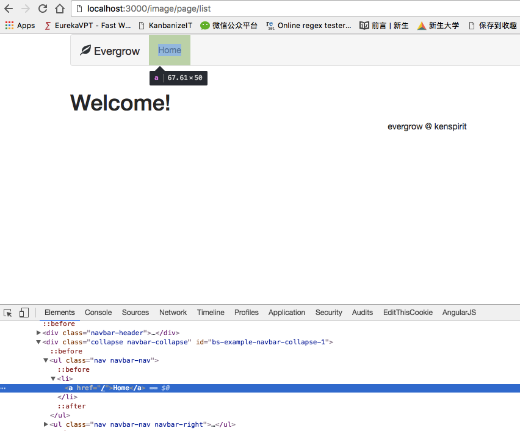
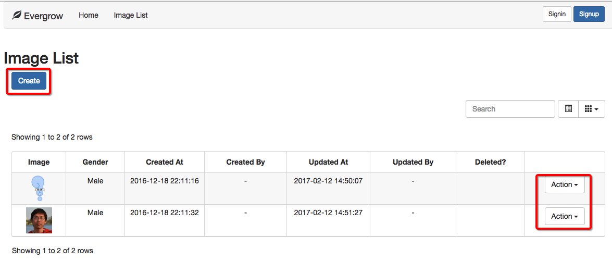
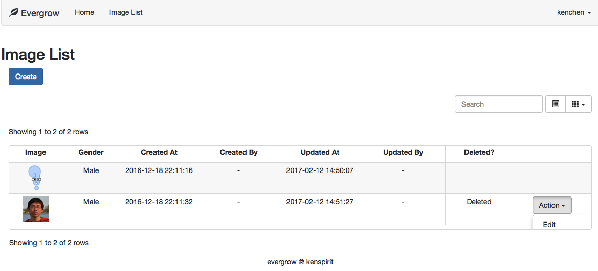

# Node.js 微信后台搭建系列 - 登录验证和授权

帐号登录验证和权限设置，可以说是任何一个系统都必须具备的基本功能。无论是电商，社交，还是企业系统，甚至连输入法等工具，都可以让你注册一个帐号。方式从最传统的帐号密码登录，到用社交帐号绑定不等。  

## 登录验证（Authentication）

登录有什么用呢？最基本的目的当然是为了让系统在茫茫人海中认得你。你上次来干什么了，做到哪一步，这次需要接着做吗？当然，验证的部分是为了不让其他人冒充你。所以，最基本的功能就是：  

* 记得之前的你  
* 确保真的是你  

### 会话（Session）

为了让系统记得之前的你，后台当然要保存和记录一些数据，比如你的个人资料，上次没有写完的文档。但是，比如说你用浏览器打开了你的邮箱，写邮件，系统怎么知道这次保存的邮件内容，是你的，而不是别人的呢？不可能让你每保存一次都用密码验证一下吧？  

其实，当你成功登录验证后，服务器端通常会生成并维护一个会话，同时为这个会话绑定一个 ID（Session ID）。然后它把这个 ID 通过 Cookie 保留在你访问服务器的浏览器端。  

后面每一次对服务器的请求或操作，浏览器都会带上这个 Cookie，服务器通过 Session ID 来提取相应的 Session 数据，并识别出你。所以你的每一个操作，系统都能知道是你，并记得之前的你。但是，如果这个会话过期了（比如说登录后长时间没任何操作），系统就需要你重新登录验证一次才能继续操作。  

虽然服务器的 Session 允许存储不少信息，但是一般只存储用户 ID 就够了。**数据存储的越多，越浪费内存和影响性能**。同时，在一些用户量大，需要做负载均衡的系统，任何一个请求都不能保证下一次和这次通信的服务器是同一个，所以 Session 的数据一般都存储在所有服务器都能访问的内存型数据库，比如 Redis。  

在 `evergrow` 框架里面，Session 的配置代码在 `/system/session-manager.js` 文件里。`evergrow` 也是使用 Redis 来存储 Session 资料，所以在你需要使用 Session 功能时，记得启动 Redis 服务器。  

### Passport

[Passport]: http://passportjs.org/

为了确保真的是你，系统必须使用某一种方式来登录验证。要自己写一个登录验证的功能不难。但是要写一个好用，并且容易扩展的验证功能就不容易了。`evergrow` 使用了一个叫 [Passport][] 的中间件，并默认提供了最基本的帐号密码登录的方式。等你了解了 Passport 的使用后，你就可以轻松地改成用微信，微博登录等。  

我们先来看看 Passport 的配置。代码基本都在 `/module/auth/auth-manager.js` 里面，才 50 行。  

```javascript
  // 1) Part 1
  function configureAuth(app) {
    app.use(passport.initialize())
    app.use(passport.session())
  }

  // 2) Part 2
  passport.serializeUser(function(user, done) {
    done(null, user._id)
  })

  passport.deserializeUser(function(id, done) {
    UserManager.load(id)
      .then(function(user) {
        done(null, user)
      })
  })

  // 3) Part 3
  function localAuth() {
    return passport.authenticate('local', {failWithError: true})
  }

  passport.use(new LocalStrategy({
    usernameField: 'loginId',
    passwordField: 'password',
    passReqToCallback: true
  },
  function(req, loginId, password, verified) {
    if (!loginId || !password) {
      verified(null, false, {message: 'Invalid login info.'}) // err, user, info
      return
    }

    UserManager.findLocalUser(loginId)
      .then(function(user) {
        return UserManager.validatePassword(password, user)
          .then(function(isValid) {
            if (user) {
              delete user.password
            }

            return isValid ? user : null
          })
      })
      .then(function(user) {
        if (user === null) {
          verified(null, false, {message: 'Invalid login info.'})
          return
        }

        logger.info({req: req}, 'User Login successfully')
        verified(null, user)
      })
      .catch(verified)
  }))
```

第一部分只是配置。`configureAuth` 方法在 `/system/server-manager.js` 里面被调用。要注意的是它应该在配置 Session 之后才调用。  

第二部分是序列化（serialize）和反序列化（deserialize）用户信息。这里就是前面说的在 Session 里存储什么数据了。序列化的时候，你们看到我只存了 `user._id`。反序列化的时候，通过前面存的 id 在通过查找数据库 `UserManager.load(id)` 来获取用户，然后放到 Session 里，供后续的中间件或代码使用（通过 `req.user` 获取）。  

第三部分是注册验证手段到 Passport 里面。因为默认 `evergrow` 用的是帐号密码登录，所以这里的配置就是用的 `LocalStrategy`。不同的验证方式在 Passport 里面是通过注册不同的插件来实现的。这部分代码其实不难，大意就是通过哪些字段获取帐号和密码信息，然后如何根据这些信息判断是否有这样的用户，和提供的资料是否准确。如果你想换不同的登录验证方式，找另一个插件来配置一下就可以了。  

如何使用配置好的登录验证方式呢？其实就在登录的那个路由，文件 `/module/auth/auth-routes.js` 里。`AuthManager.localAuth()` 方法返回的中间件，就是我们配置的插件，会自动帮我们做登录验证。登录验证通过后，操作就会传递到 `AuthController.signin` 里做下一步操作了，比如根据用户类型跳转去不同的页面。  

```javascript
  {
    method: 'post',
    path: '/signin',
    summary: 'Sign In',
    description: '',
    action: [AuthManager.localAuth(), AuthController.signin],
    validators: {
      body: joi.object().keys({
        loginId: joi.string().required(),
        password: joi.string().required()
      })
    }
  }
```

登录验证配置部分到这里就完了，下面我们看看如何让系统知道每一次操作的人是谁，并知道他的身份和权限。  


## 授权（Authorization）

登录验证是为了确定你的身份，有机会进入系统的大门。授权是为了确定做的操作，都是被允许的，你有被赋予权限。系统需要知道你是普通用户，还是论坛坛主，又或者是整个系统的超级管理员。  

`evergrow` 里通过 `/module/user/user-model.js` 的 `isAdmin` 标记来简单区分你是管理员还是普通用户。虽然简单，但是搞清楚原理后，再按照自己需求修改就可以使用 ACL 或者 RBAC 之类的模式。  

### 如何控制权限

最简单的权限控制，可以是根据登录的用户类型，在浏览器的页面里，禁止或者隐藏相应的按钮或者链接。因为现在很多页面都是通过 Ajax 来请求数据并动态渲染，所以不少人会简单在前端来实现这样的功能。但是，这样做是相当危险的。稍微有点开发知识的人，都能轻易显示你网页上隐藏的内容。  

那么，是否通过服务端渲染页面来隐藏就可以了呢？这也是不够的。如果你的请求路由和参数被猜到，但是没有限制特定的人群才能访问，比如修改用户资料的接口，那么一些黑客就能夺取你系统的超级用户权限。  

[Hacker commandeers GitHub to prove Rails vulnerability]: https://arstechnica.com/business/2012/03/hacker-commandeers-github-to-prove-vuln-in-ruby/?comments=1

有兴趣的朋友可以看一看 [Hacker commandeers GitHub to prove Rails vulnerability][] 这篇文章。里面提到的「Mass assignment vulnerability」在 Ruby on Rails 和 Node.js 系统里面很常见。所以，在 `evergrow` 框架，每一个请求都用 `joi` 来限定能提交的参数名字和类型，并通过中间件来保护特定的接口。  

我们来看下面的代码：  

* `AuthController.ensureAuthenticated` 这个中间件，就是帮我们确认用户是否已经登录。  
* `UserController.isAdmin` 确保操作的用户是管理员。  
* `UserController.isOwner` 确保链接传的 `id` 参数，是当前登录用户的 `id`。  

所以，下面的配置意思就是：获取用户的接口只能是登录后的用户，并且是管理员才能调用。修改用户资料的接口，只允许指定的字段提交修改，像 `isAdmin` 这样的字段肯定不能提交。用户自己只能修改自己的信息。  

```javascript
  {
    method: 'get',
    path: '/',
    summary: 'Gets all users',
    description: '',
    action: [AuthController.ensureAuthenticated, UserController.isAdmin, UserController.listUser],
    validators: {
      query: joi.object().keys({
        search: joi.string().allow(''),
        order: joi.string().valid('desc', 'asc').default('asc'),
        limit: joi.number().integer().max(100).default(10),
        offset: joi.number().integer()
      })
    }
  },
  {
    method: 'post',
    path: '/:id',
    summary: 'Updates user profile',
    description: '',
    action: [AuthController.ensureAuthenticated, UserController.isOwner, UserController.updateUser],
    validators: {
      body: joi.object().keys({
        loginId: joi.string().required(),
        phone: joi.string().required(),
        email: joi.string().email(),
        password: joi.string(),
        imageUrl: joi.string(),
        confirmPassword: joi.string()
      })
    }
  }
```

## evergrow 的设置

为了方便测试，所以还没有加任何权限控制在前两章的 API 上，现在是时候了。假设我们的需求是：  

1. 任何人都能看到所有没有删除的，审批通过的图片。  
2. 登录后，自己还可以看到审批中，或者自己删除了的图片，并可以重新上传图片。  
3. 管理员可以做上面任何操作，并且可以通过，或者拒绝任何图片。  

我先带大家在 evergrow 里实现前两点，第三点作为练习。  

### 页面权限控制

既然所有人都能看到图片，我们先在导航栏放一个链接打开图片列表页。打开 `/view/common/_nav.html`，可以看到有这么一小段代码：  

```html
  <ul class="nav navbar-nav">
    <li><a href="/">Home</a></li>
  </ul>
  <% if (typeof(currentUser) !== 'undefined' && currentUser && currentUser.isAdmin) { %>
  <ul class="nav navbar-nav">
    <li><a href="/user/page/list">User Management</a></li>
  </ul>
  <% } %>
```

这里有两个链接：  

* `/` Home 页面在最左边。谁都可以访问
* `/user/page/list` 是用户管理页面，但是只有管理员（有 `isAdmin` 标记的用户）才能访问

这里比较特别的地方就是 `<% ... %>` 里面包含的代码。首先，如视图那章所说，它是被模板引擎执行的代码。然后这里访问的 `currentUser` 是什么呢？它就是当前登录的用户。如果你的页面路由调用了 `AuthController.ensureAuthenticated` 或者 `AuthController.setUserToResources` 中间件，在页面模板里面就能访问这个变量。  

所以，这段代码的意思就是，只有当浏览页面的用户是管理员的话，才能把 User Manangement 的链接代码包含到页面里。用 Chrome 打开页面，按 F12（Windows 里）或者 Option+Command+I（Mac 里）调出开发者工具，使用元素选择工具点击 Home 链接，就能看到效果如下图。这就是后端渲染和权限控制的好处之一。  



所以，如果你要加谁都可以访问的图片列表页，只要把下面一段代码加到它们中间好了。  

```html
  <ul class="nav navbar-nav">
    <li><a href="/image/page/list">Image List</a></li>
  </ul>
```



不过由于我们的页面没有任何控制，所以 `Create` 按钮和列表里面的 `Action` 操作栏都存在，所以我们要改进一下。同上面的原理一样，我们可以在 `/view/image/imageList.html` 做一点小改动：  

```html
  <h2>Image List</h2>
  <div class="col-sm-12" style="margin-bottom: 10px">
    <% if (typeof(currentUser) !== 'undefined' && currentUser) { %>
      <div class="pull-left">
        <button class="btn btn-primary" v-on:click="createImage">Create</button>
      </div>
    <% } %>
  </div>

  // 省略

  </div>
  <script>
  var isLogin = false
  var userId = null

  <% if (typeof(currentUser) !== 'undefined' && currentUser) { %>
    isLogin = true
    userId = '<%= currentUser._id %>'
  <% } %>
  </script>
  <%
    block('moduleScript').append(
      Loader('/public/build/imageList.min.js')
        .js('/public/js/common/common.js')
        .js('/public/js/image/imageList.js')
        .done(assets, config.site_static_host)
    )
  %>
```

这里有一点点不同的就是，多了一个 `<script>` 标记。里面定义了一个 `isLogin`，`userId` 变量，然后根据用户是否登录来设置它的值，最后在 `/public/js/image/imageList.js` 里根据它们来决定是否把最后一列放到 `columns` 数组里面。  

```javascript
  // 省略

  }, {
    field: 'deleted',
    title: 'Deleted?',
    width: 60,
    align: 'center',
    halign: 'center',
    formatter: function(value, row, index) {
      return value === true ? 'Deleted' : ''
    }
  }]

  if (isLogin) {
    columns.push({
      field: '',
      title: '',
      width: 60,
      align: 'center',
      halign: 'center',
      events: {
        'click .edit': (e, value, row, index, activeBtn) => {
          $('#imageId').val(row._id)
          $('#imageUrl').val(row.url)
          $('#gender').val(row.gender)
          $('#deleted').prop('checked', row.deleted)
          $('#imageDialog').modal('toggle')
        }
      },
      formatter: function(value, row, index) {
        if (row.createdUserId !== userId) { // 如果图片不是当前用户创建的，不能修改
          return ''
        }

        return `<div class="btn-group dropdown">
          <button type="button" class="btn btn-default dropdown-toggle" data-toggle="dropdown" aria-haspopup="true" aria-expanded="false">
            Action <span class="caret"></span>
          </button>
          <ul class="dropdown-menu">
            <li class="edit"><a href="#">Edit</a></li>
          </ul>
        </div>`
      }
    })
  }

  var vue = new Vue({
  // 省略
```

好了，页面处理完了，剩下就是控制后台如何区分登录还是没有登录，最后决定列出不同的图片给用户。  

### 后端权限控制

我们找到图片列表对应的 Controller，把查询的逻辑修改如下就可以了。`req.user` 就是获取登录用户的方式。如果没有这个信息，操作的就是没有登录的用户。  

查询数据库的时候，一般只要把 Model 里面的字段，和对应你想过滤的值，设到 params 里面就可以了，像没登录那种情况一下。  

不过这里还有一些特殊的符号，如 `$or`, `$ne`。它们是 MongoDB 的操作符，对应的意思是`或者`，`不等于`（not equal），详情可参考 MongoDB API。

```javascript
  function listImage(req, res, next) {
    req.query.sort = 'updatedAt'

    var params = parseRequestParams(req)
    var user = req.user

    if (!user) {
      // 没登录
      params.deleted = false
      params.status = IMAGE_CONSTANTS.STATUS_APPROVED
    } else if (!user.isAdmin) {
      // 登录，普通用户
      var userId = user._id.toString()

      params.$or = [{
          createdUserId: userId
        }, {
          createdUserId: {$ne: userId},
          deleted: false,
          status: IMAGE_CONSTANTS.STATUS_APPROVED
        }]
    }
    // 管理员什么特殊处理也不需要

    ImageManager.list(params)
      .then(function(entities) {
        return res.json(parseResultForTable(entities))
      })
      .catch(next)
  }
```

最后的页面效果如下图：  



## 练习

* 只有打开自己创建的图片，才能有修改的权限。（参考用户资料修改页面相关代码：`loadUserPage`, `/view/user/userProfile.html`, `/public/js/user/userProfile.js`）
* 管理员可以浏览，删除，修改，通过，或者拒绝任何图片。  
