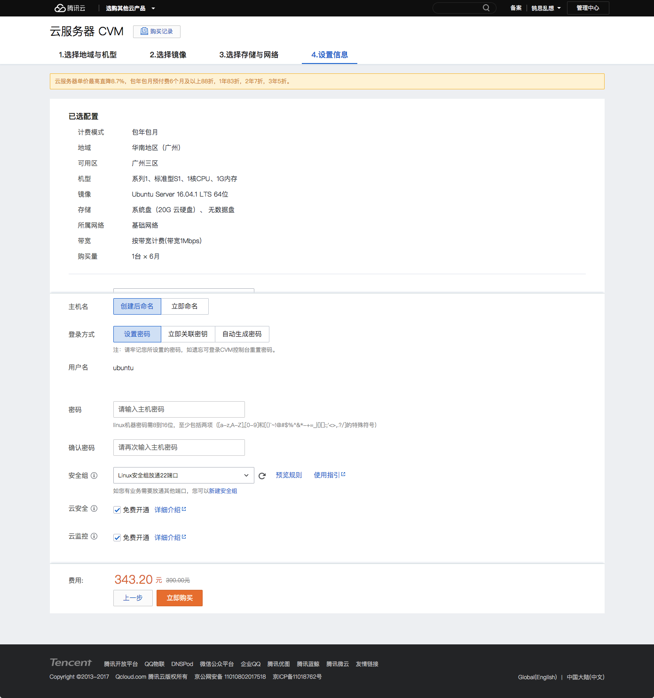
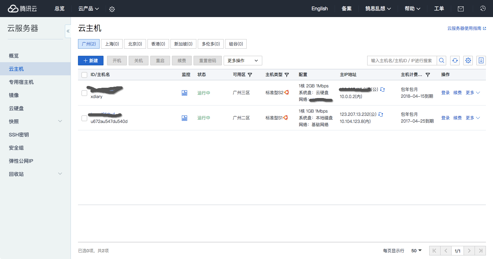
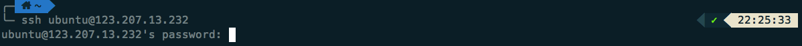
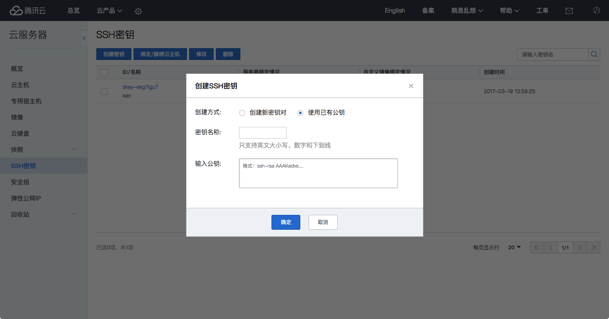
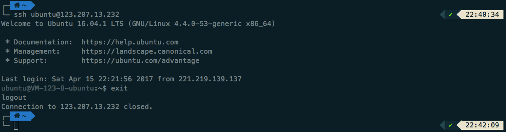
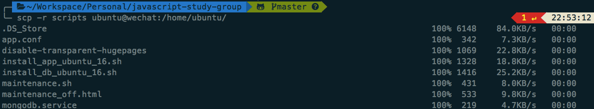

# Node.js 微信后台搭建系列 - 服务器环境配置

我们的后端代码已经基本成型了。为了让它成为真正的微信后台，我们必须将代码部署到服务器，以便微信能够和我们的后台通信，把我们公众号收到的消息转发给我们，以便我们进行后续的处理。  

## 申请云主机

目前国内比较知名的云计算服务商有阿里云，腾讯云，UCloud，美团云，青云等。国外的有 AWS，Google Cloud，Microsoft Azure 等。  

鉴于我们的服务器是为了承担微信公众号后台，本身腾讯云对微信的服务器网络解析和连接都有优化，所以我就选了腾讯云来作为我的云主机提供商。  

目前在 https://www.qcloud.com/ 还有 30 天的云服务器免费使用。大家可以选择离自己近的区域购买服务器，我买的是广州 3 区的，配置大概如下：  

付款后，就能看到你的云服务器在「云主机」页面列出来了。  

### 验证远程登录

机器准备好了后，我们可以测试能否登录上机器了。我们通过 ssh 命令和分配的公网 IP 来登录：  

这时，你输入你购买机器时配置的密码，就可以登录了。但是，这种方式其实不太安全，密码设简单容易让别人破解，复杂了还不好记。所以，我们可以利用密钥要登录。我们点击操作台菜单的「SSH 密钥」选项，然后点击按钮「创建密钥」，就可以根据需要生成新的密钥对，或者利用你系统已经有的公钥来直接绑定。  

在 Mac 下通过下面的命令就可以复制已有的公钥到剪贴板（假定你使用 Github 后应该已经有密钥了）:  

`pbcopy < ~/.ssh/id_rsa.pub`

然后粘贴到弹窗中「输入公钥」的文本框，命名保存。  

最后，把刚才新建的密钥，绑定到你的主机就可以 SSH 无密码登录了。  

下图是登录后，和退出的样子。  

## 安装软件

### 准备安装脚本

确保能远程到机器，我们就可以准备安装所需要的工具软件了，因为一开始它基本是裸机，只有你指定的操作系统。  

因为只是个人使用，所以我没有买云的数据库和缓存，也没有分开两台机器来各自安装数据库和我们的后台，虽然理论上来说，数据库应该要和 Application 分开。  

在 [script](../../scripts) 文件夹下面，我准备了所有需要用到的安装和配置脚本。首先，我们通过 scp 的命令把他们复制到服务器上面。（你们只要把 `wechat` 替换为你们机器的公网 IP 就行了）  

复制完文件，我们就登录进去检查一下。通过 `cd scripts` 进入文件夹，`ll` 查看文件详情，`chmod +x *.sh` 为所有可执行的文件（.sh 后缀）添加运行的权限。  

### 安装 Redis 和 MongoDB

我们只需要执行命令 `sudo ./install_db_ubuntu_16.sh`，脚本就会下载所有相关的文件，安装，配置，和设定 Redis 和 MongoDB 为自启动服务。  

所有的命令完成，返回命令行后，我们可以 `sudo reboot` 来重启机器，然后再通过 `redis-cli` 和 `mongo` 来确定 Redis 和 MongoDB 是不是都安装启动正常了。  

### 安装 Nginx，Node.js，NPM 和 PM2

同理，我们只需要执行命令 `sudo ./install_app_ubuntu_16.sh`，脚本就会下载所有相关的文件，安装和配置。  
