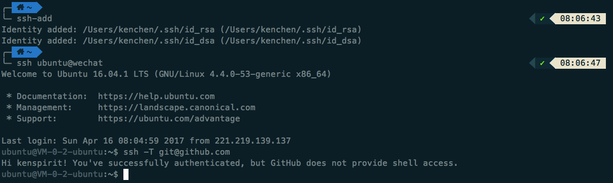
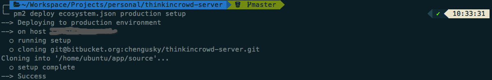
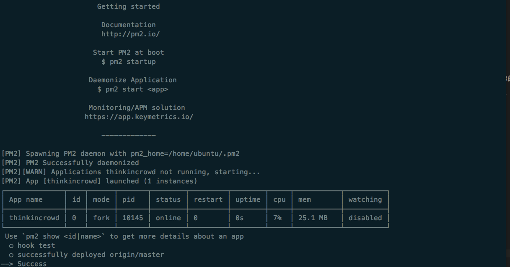
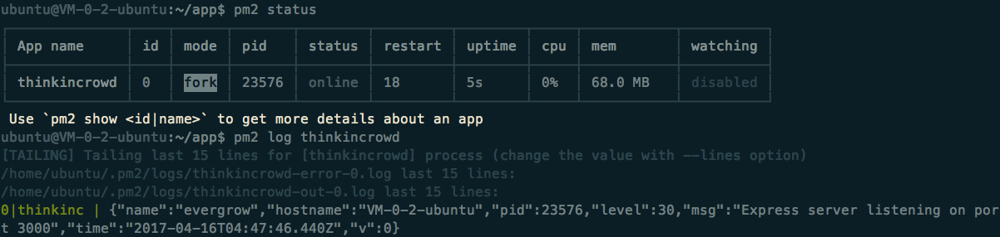
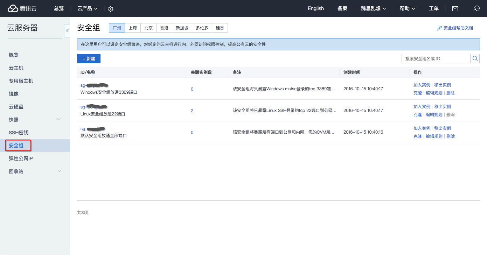
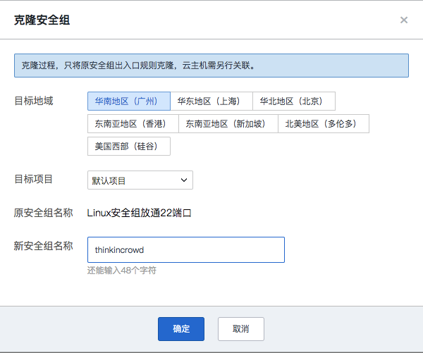
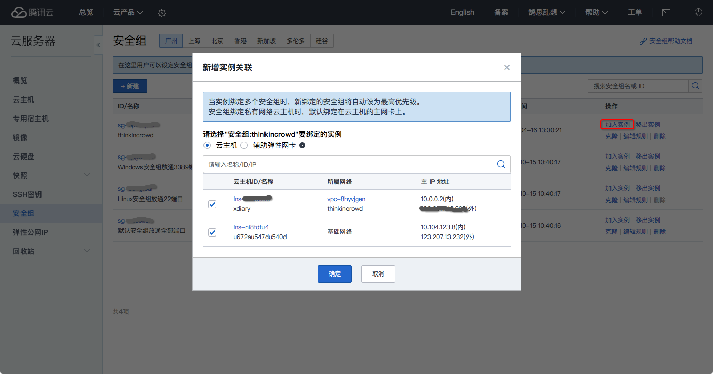
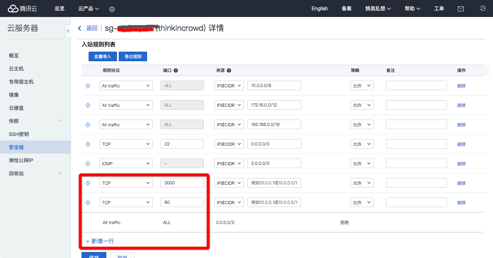

# Node.js 微信后台搭建系列 - 服务器代码部署

机器都好了，是时候让我们的代码上场了。完成了这一步，即便你不做微信后台，你也拥有一个能提供完整后端服务的服务器了。  

## SSH Agent Forwarding

要把代码部署到服务器的话，首先服务器能拥有和我们同等的权限去 Github 拉取代码。配置了 SSH 代理后，我们就不必把我们的 key 放到服务器，直接使用本地的就可以了。  

### 修改 `.ssh` 目录权限

当我们在前面绑定了我们的密钥到机器时，`.ssh` 目录就已经创建了。但是它的拥有者是 `root`，之后当我们想把 Github 的地址加入里面的 `known_hosts` 就会出问题。所以，我们要先 SSH 到机器上面，通过下面的命令，把这个目录的拥有者改过来。

`sudo chown ubuntu:ubuntu .ssh/`

### 允许本地 Forward 

* 使用你的文本编辑器，打开 `~/.ssh/config` 这个文件。如果不存在这个文件，通过命令 `touch ~/.ssh/config
` 来创建  
* 在文件里面添加下面两行配置，把 `my-server.com` 换成你服务器的公网地址：  

  Host my-server.com  
    ForwardAgent yes

### 测试验证

首先通过命令 `ssh-add` 把你的命令加到 ssh-agent。_这句命令不是每次都需要的，在 Mac 里，偶尔 agent 会不记得这个 key，所以如果你发现突然不好使了，先运行一下这命令就好了。_

登录服务器后，通过命令 `ssh -T git@github.com` 看到 Github 的欢迎语就表示配置成功了：  



[Using SSH Agent Forwarding]: https://developer.github.com/guides/using-ssh-agent-forwarding/  

如果还有什么问题，可以参考 Github 提供的更详细的文档 [Using SSH Agent Forwarding][]。  


## PM2 设置

虽然我们的服务器已经可以像我们一样去拉代码了，但是我们总不能每次部署，就 SSH 登录服务器，git pull 一下代码，npm 安装必要的包，然后手动重启程序吧？  

前面安装的 PM2 在这个时候就能发挥作用了。只要我们轻巧一段代码，它就能帮我们做到上面说的所有的步骤，把代码部署好。  

### 初始化

SSH 登录服务器，通过 `mkdir` 命令建立代码目录，比如：`mkdir app`。

然后修改 `ecosystem.json` 文件如下：  

```javascript
  {
    "apps": [
      {
        "name": "project",
        "script": "index.js",
        "env_production": {
          "NODE_ENV": "production"
        }
      }
    ],
    "deploy": {
      "production": {
        "user": "ubuntu", // Linux 用户名
        "host": "123.207.13.232", // 填写你的服务器公网地址
        "ref": "origin/master",
        "repo": "git@bitbucket.org:chengusky/thinkincrowd-server.git", // 填写你的代码地址
        "path": "~/app", // 新建的代码目录
        "post-deploy": "npm install && pm2 startOrRestart ecosystem.json --env production",
        "env": {
          "NODE_ENV": "production"
        }
      }
    }
  }
```

然后在本地命令行执行以下命令：  

`pm2 deploy ecosystem.json production setup`

成功后应该见到类似提示信息：  



### 部署

一般来说，不同的情景用不同的 `NODE_ENV` 环境变量，并引用不同的配置文件。开发的环境是 `development`，还有测试环境 `test` 和线上环境 `production`。所以，部署前，你还要准备一个新的配置文件 `production.js` 放在 `config/base/` 目录下。  

今后，每次修改了代码并 push 到 Github，你都只需要执行以下命令就可以完成部署了：  

`pm2 deploy ecosystem.json production`

成功后应该看到类似的提示信息：  



然后我们再 SSH 登录服务器，输入命令 `pm2 status` 就能够看到服务器运行状况。 `pm2 log thinkincrowd` 就能够看到你的服务器日志（把 `thinkincrowd` 替换为你的 app 的名字）。




## 开放服务器端口

到这里，离服务器能访问就只剩下最后一步了。  

在我们购买云主机的时候，我选择的安全组是「Linux安全组放通22端口」，它默认只让外界通过 22 端口，也就是 SSH 来访问机器。  

那么，现在我们来放开必要的端口，让我们能在浏览器访问我们的系统。  

### 新增安全组

点击「安全组」选项：  



克隆原来的「Linux安全组放通22端口」，并自己命名：  



点击「加入实例」操作，并选择你的主机，确定就可以了：  



### 新增端口

选择我们刚新建的安全组，点击「编辑规则」操作，新增两行，并分别输入 `3000` 和 `80` 端口：  



大功告成。现在在浏览器输入你主机的公网 IP 和端口（3000 或者 80），看看你的服务器是不是就能访问了？为什么 80 端口也可以？我们的 Node.js 服务明明是 3000 的啊。前面安装的 Nginx 帮你搞定了一切。  


_注意：很多云服务商会要求机器绑定的域名要备案了才能开放 80 端口，要不然会被封。所以，在我们拥有一个备案了的域名前，还是先别开放 80 端口吧。_
