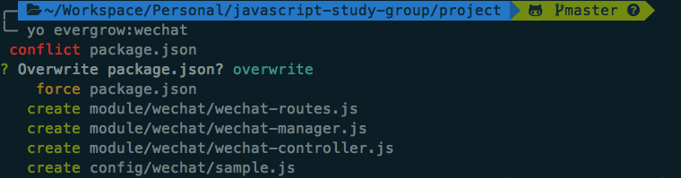

# Node.js 微信后台搭建系列 - 微信集成

终于基本到了最后的一步了。微信集成主要包含三个部分：  

1. 接入验证，让微信确认你的服务器，就是你公众号的拥有人。  
2. 接收微信给你服务器的消息。  
3. 发送消息给微信服务器，让它转发给你公众号的关注者。  

公众号的基本开发，微信的官方文档「[入门指南][]」其实已经基本包含所有必须要知道的知识。但是，它的文档是以 Python 为例子，还有一些比较看起来吓死人的流程图，技术细节，和一些个人号没法开通的功能介绍。所以，这篇教程是侧重于个人公众号如何用 JavaScript 来开发实现。  

[入门指南]: https://mp.weixin.qq.com/wiki?t=resource/res_main&id=mp1472017492_58YV5


## 接入验证

[申请微信个人公众号]: https://mp.weixin.qq.com/cgi-bin/loginpage?t=wxm2-login&lang=zh_CN

怎么[申请微信个人公众号][]，我就不说了。个人只能申请订阅号。  

申请成功后，登录，点击左边菜单栏下面的「开发」->「基本配置」，可以看到如下页面：  


先把 `开发者ID(AppID)` 和 `开发者密码(AppSecret)` 分别复制出来，保存在一边。`令牌(Token)` 是自己定的不让别人知道的字符串。下面我们来看看系统里如何配置，接入微信。  

打开命令行，进入你的项目目录，然后输入以下命令：  

`yo evergrow:wechat`  

它会提醒你是否要覆盖 `package.json` 文件，你可以输入 `d`，按 `Enter` 看有什么变动。其实只是新加一些必要的包，所以你输入 `Y`，然后覆盖就可以了。正常的话，操作后会如下图那样，新生成几个微信相关的文件。  



打开 `config/wechat/sample.js` 文件，内容如下：  

```javascript
  module.exports = {
    appToken: 'evergrow',
    appId: '',
    appSecret: ''
  }
```

你要做的是，复制 `sample.js` 文件，重命名为 `production.js`，然后把前面保存的 `开发者ID(AppID)` 和 `开发者密码(AppSecret)` 分别赋值给 `appId` 和 `appSecret`。`appToken` 不用理会。**appToken 和 appSecret 可不要让别人知道！**以我的为例：  

```javascript
  module.exports = {
    appToken: 'mytoken', // 自己定义，
    appId: 'wxe5284a1d0aa6b9fb',
    appSecret: 'asldgjoieadgkladlj'
  }
```

设置完了以后，你就可以部署到服务器上面了。  

确定你的服务器已经启动后，你就可以在微信「启用」你的服务器了。服务器的 URL 就填你的服务器地址(或 IP)，加上我们微信集成模块的路由 `/wechat`，比如： `http://www.mydomain.com/wechat/`。  


## 接收消息

启用后大概要过三五分钟可能才会生效。然后，如果你发一段文字给你的公众号，你的服务器会打印出接受到的消息内容。  

### 文字消息

```javascript
  {
    ToUserName: 'gh_1bfda0ee00eb',
    FromUserName: 'oZQ1dwRfxWyDpRjBNBS5DcltOAU4', // 发消息给你的用户的 openid
    CreateTime: '1501422823',
    MsgType: 'text',
    Content: 'Hello',
    MsgId: '6448561922693293780'
  }
```

### 关注公众号的消息  

```javascript
  {
    ToUserName: 'gh_1bfda0ee00eb',
    FromUserName: 'oZQ1dwRfxWyDpRjBNBS5DcltOAU4', // 关注者的 openid
    CreateTime: '1501423109',
    MsgType: 'event',
    Event: 'subscribe',
    EventKey: ''
  }
```

### 图片消息

```javascript
  {
    ToUserName: 'gh_1bfda0ee00eb',
    FromUserName: 'oZQ1dwRfxWyDpRjBNBS5DcltOAU4',
    CreateTime: '1501423196',
    MsgType: 'image',
    PicUrl: 'http://mmbiz.qpic.cn/mmbiz_jpg/zQibzicfvUiciaoqcE4kibLSnIvGs2SI0g5zHSnUQFeXvom1SHLEAHK8csInU7jXodQaG1ScxibfwkSG7MEK09xyukTQ/0',
    MsgId: '6448563524716095218',
    MediaId: 't-4AThjfL-GK2vbKh3XRX9go-DE-Z3hvHNFwA9Bb2Ep_xUK5r13eYlJqsD8FLqqw'
  }
```

## 发送消息

知道了上面几大类型的消息格式，我们就可以做一些东西了。  

微信消息的接收和处理，都在 `wechat/wechat-controller.js` 里面的 `wechatMsg` 方法里处理就可以了。它默认生成的代码是这样的：  

```javascript
  module.exports.wechatMsg = WechatManager.getWechatRouter(function(req, res, next) {
    // 微信输入信息都在req.weixin上
    var message = req.weixin
    console.log(message);

    res.reply('')
  })
```

### 关注自动回复

如果要在用户关注后自动回复，我们可以在上面的方法里加如下的代码：  

```javascript
  module.exports.wechatMsg = WechatManager.getWechatRouter(function(req, res, next) {
    // 微信输入信息都在req.weixin上
    var message = req.weixin
    console.log(message);

    // 自动回复处理
    if (message.MsgType === 'event' && message.Event === 'subscribe') {
      return res.reply(`非常感谢你的关注。点击菜单栏的 “历史文章” 可查看我精心分类的文章列表。

儿子，丈夫，父亲，程序员。每一个标签，都是对我的一个要求。在这里，所有的文字都用心创作，记录了我在每一个标签下逐渐成长的经历和思考。希望某一篇文章，甚至某一句话，能与你产生共鸣。

<a href="http://mp.weixin.qq.com/mp/homepage?__biz=MzI0NDEwMDk2NQ==&hid=1&sn=b1cd332c53a573ea36c4a71e19f47539#wechat_redirect">历史文章</a>`)
    }

    res.reply('')
  })
```

_因为启用自己的服务器后，自定义菜单功能就没有了，我只能在关注自动回复加链接去我的历史文章页了（哭）。_


### 回复用户发来的图片

如果我们想直接把用户发给我们的图片回复回去，我们可以这样做：  

```javascript
  module.exports.wechatMsg = WechatManager.getWechatRouter(function(req, res, next) {
    // 微信输入信息都在req.weixin上
    var message = req.weixin
    console.log(message);

    // 自动回复用户发来的图片
    if (message.MsgType === 'image') {
      return res.reply({
        type: 'image',
        content: {
          mediaId: message.MediaId // 用回微信告诉我们的用户发来的图片 MediaId
        }
      })
    }

    res.reply('')
  })
```

有了这些基础，你可以按自己的需求，来实现其它自动回复的功能。下一章我们再看如何结合之前的系统，随机抽取系统接收的其它用户发来的图片，而不是返回自己当前发来图片。  

## 练习

* 添加关键字自动回复  
* 回复其它类型的消息，可参考文档 https://www.npmjs.com/package/wechat  
